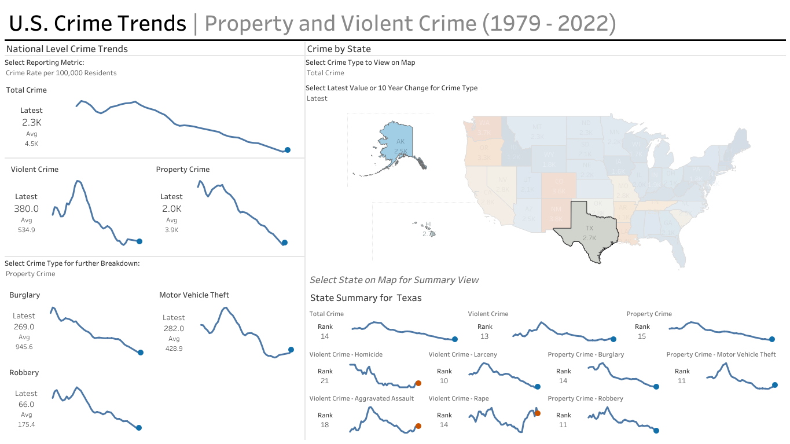
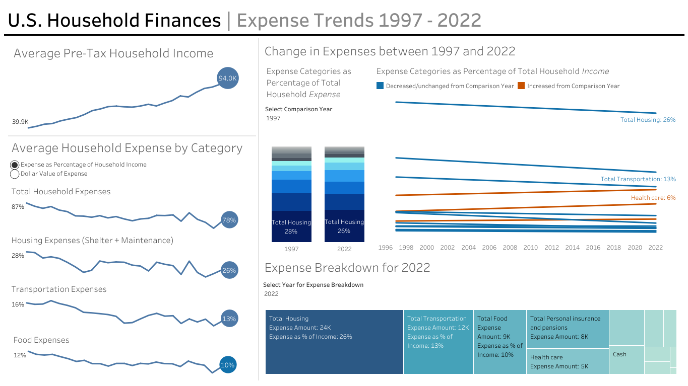

_________________________________
The following projects Visual Analytics examples I have built using publically available data. The key to developing high quality visual analytics solutions is to follow sound design principals and focus on extracting insights with minimal cognitive load. 

_________________________________

## [U.S. Crime Trends from 1979 - 2022](https://public.tableau.com/views/WorkinProgress_17120271257940/USCrimeTrends1979to2022-Frame?:language=en-US&:sid=&:display_count=n&:origin=viz_share_link)
The following visualization explores U.S. crime data by state as made publically available by the FBI. Crime is shown at an overall level down to a breakdown of violent and property crimes. An interactive map of the U.S. enables the user to uncover deeper insights at state level to understand:

- Trend by crime types
- Ranking of states by crime types

_Insights_
Overall, it is evident that crime levels have declined across the U.S. since the early 90s. Some interesting finds include:
- The overall growth of crime in the last 10 years in Colorado (+22%) is an anomaly compared to the rest of the country. 
- Violent crime has grown across the nation in the last 10 years with Colorado (+60%) and Montana (+50%) leading the way.
- The state of Florida leads the way in defying this trend in violent crime however with a decline of 47% in the past 10 years. 
- Rape in particular has increased in the past 10 years across the country with Wyoming (+135%) and New York (+104%) leading the way.

## [U.S. Household Expense Trends 1997 - 2022](https://public.tableau.com/views/WorkinProgress1_17115308425000/HouseholdExpensesTrendSummary?:language=en-US&:sid=&:display_count=n&:origin=viz_share_link)
This visualization explores household spending trends recorded as part of the US Bureau of Labor Statistics - Consumer Expenditures Report. This provides some interesting insights overall areas where spending has changed and also the breakdown of household spending across years.

_Insights_
- Spending in all major areas have declined as a percentage of household income.
- Total household expenditure has declined 9% since 1997.
- Healthcare and Insurance payments however have both increased by 1% of total income spend.

test
